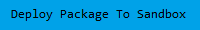

# Duplicate Management Enhancements <!-- omit in toc -->


[](https://github.com/dschach/duplicatehandling/actions/workflows/ci.yml)
[](https://github.com/dschach/duplicatehandling/actions/workflows/codecov.yml)
[](https://codecov.io/gh/dschach/duplicatehandling)
[](https://twitter.com/dschach)

> This application is designed to run on the Salesforce Platform.

## [Changelog](./CHANGELOG.md)

## Table of contents <!-- omit in toc -->

- [Changelog](#changelog)
- [Package Installation](#package-installation)
  - [Quick Deploy](#quick-deploy)
  - [Installing the app using a Scratch Org](#installing-the-app-using-a-scratch-org)
  - [Installing the app using a Scratch Org (Step-by-step)](#installing-the-app-using-a-scratch-org-step-by-step)
  - [Installing the App using a Developer Edition Org or a Trailhead Playground](#installing-the-app-using-a-developer-edition-org-or-a-trailhead-playground)

## Package Installation

<a href="https://login.salesforce.com/packaging/installPackage.apexp?p0=04t3a000000LdirAAC">
  
</a>
<a href="https://test.salesforce.com/packaging/installPackage.apexp?p0=04t3a000000LdirAAC">
  
</a>

<br/>

### Quick Deploy

<a href="https://githubsfdeploy.herokuapp.com">
  
</a>

### Installing the app using a Scratch Org

1. Set up your environment. Follow the steps in the [Quick Start: Lightning Web Components](https://trailhead.salesforce.com/content/learn/projects/quick-start-lightning-web-components/) Trailhead project. The steps include:

   - Enable Dev Hub in your Trailhead Playground
   - Install Salesforce CLI
   - Install Visual Studio Code
   - Install the Visual Studio Code Salesforce extensions, including the Lightning Web Components extension

1. If you haven't already done so, authorize your hub org and provide it with an alias (**myhuborg** in the command below):

   ```bash
   sf org login web --set-default-dev-hub --alias myhuborg
   ```

1. Clone the duplicatehandling repository:

   ```bash
   git clone https://github.com/dschach/duplicatehandling
   cd duplicatehandling
   ```

1. Run the npm script to create a scratch org, assign the permission set, and open the org
   ```bash
   npm run scratchorg
   ```

That's it!

### Installing the app using a Scratch Org (Step-by-step)

1. Set up your environment. Follow the steps in the [Quick Start: Lightning Web Components](https://trailhead.salesforce.com/content/learn/projects/quick-start-lightning-web-components/) Trailhead project. The steps include:

   - Enable Dev Hub in your Trailhead Playground
   - Install Salesforce CLI
   - Install Visual Studio Code
   - Install the Visual Studio Code Salesforce extensions, including the Lightning Web Components extension

1. If you haven't already done so, authorize your hub org and provide it with an alias (**myhuborg** in the command below):

   ```bash
   sf org login web --set-default-dev-hub --alias myhuborg
   ```

1. Clone the duplicatehandling repository:

   ```bash
   git clone https://github.com/dschach/duplicatehandling
   cd duplicatehandling
   ```

1. Create a scratch org and provide it with an alias (**duplicatehandling** in the command below):

   ```bash
   sf org create scratch --definition-file config/project-scratch-def.json --durationdays 10 --alias duplicatehandling --set-default
   ```

1. Push the app to your scratch org:

   ```bash
   sf project deploy start
   ```

1. Assign the **Duplicates Handler** permission set to the default user:

   ```bash
   sf org assign permset --name Duplicates_Handler
   ```

1. Open the scratch org:

   ```bash
   sf org open
   ```

### Installing the App using a Developer Edition Org or a Trailhead Playground

Follow this set of instructions if you want to deploy the app to a more permanent environment than a Scratch org.
This includes non source-tracked orgs such as a [free Developer Edition Org](https://developer.salesforce.com/signup) or a [Trailhead Playground](https://trailhead.salesforce.com/).

Make sure to start from a brand-new environment to avoid conflicts with previous work you may have done.

1. Clone this repository:

   ```bash
   git clone https://github.com/dschach/duplicatehandling
   cd duplicatehandling
   ```

1. Authorize your Trailhead Playground or Developer org and provide it with an alias (**mydevorg** in the command below):

   ```bash
   sf org login web --set-default-dev-hub --alias mydevorg
   ```

1. Run this command in a terminal to deploy the app.

   ```bash
   sf project deploy start --source-dir force-app
   ```

1. Assign the `Duplicates_Handler` permission set to the default user.

   ```bash
   sf org assign permset --name Duplicates_Handler
   ```

1. If your org isn't already open, open it now:

   ```bash
   sf org open --target-org mydevorg
   ```
